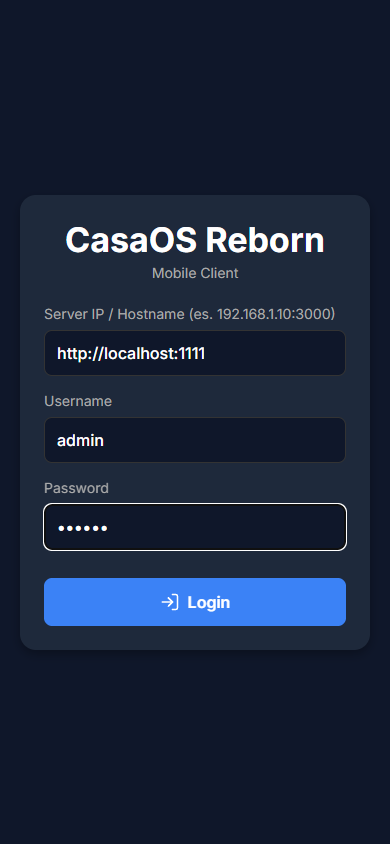

# 📱 CasaOS Reborn Mobile

<div align="center">
  
</div>
Welcome to the official mobile client repository for **CasaOS Reborn**! 
This React Native application (built with Expo) allows you to manage, monitor, and update your containers and CasaOS server resources directly from the palm of your hand, with a modern and cohesive interface.

---

## 💖 Support the Project

This app is entirely open-source and developed in my free time to bring the power of your homelab to your smartphone. If you appreciate the effort and want to support the ongoing development, updates, and bug fixes, please consider making a donation!

<div align="center">
  <a href="https://paypal.me/LorenzoCassano77" target="_blank">
    
  </a>
</div>

*Your donations keep motivation high and the project alive. Thank you!*

---

## ✨ How it works (Features)

- **📊 Interactive Dashboard:** Monitor CPU, RAM, Disk, and Network traffic in real-time.
- **🐳 Container Management:** View the status of all your Docker containers, start/stop them, or check their logs.
- **🔄 One-Tap Updates:** Quickly check and update the Docker images of your containers.
- **⚙️ Advanced Settings:** Customize app themes, configure Telegram bots for notifications, and monitor your server's health.
- **🎨 Cohesive Modern Design:** A beautifully crafted interface with automatic Light/Dark themes and standardized typography for maximum readability.

---

## 📦 Installation & Dependencies

### For End Users (No external dependencies)

**Dependencies:**
To *use* the final app on your smartphone, **no external dependencies are required** (you don't need Node.js, Expo, or anything on your PC). All you need is an Android smartphone.

**Installation Method:**
1. Navigate to the **[Releases](https://github.com/Lorenzo0010/casaos-reborn-mobile/releases)** section of this GitHub repository.
2. Download the latest available `.apk` file (e.g., `app-release.apk`).
3. Open the downloaded file on your Android smartphone. You may be asked to enable installation from "Unknown sources" in your phone's security settings.
4. Click **Install** and launch the app!

### 🔗 Backend Server Login
When you start the app for the first time, you will be prompted for your backend server IP (`casaos-reborn`) and credentials. 
Default credentials (set in the backend's `docker-compose.yml`) are:
- **Username:** `admin`
- **Password:** `casaos`

*(Ensure you enter the full IP and port, e.g., `192.168.1.50:1111`)*

> **Note on File Manager (Home Shortcut):**
> By default, the "Home" shortcut in the mobile File Manager opens the `/home` directory (since the backend runs in a Docker container). 
> If you want it to open a specific user's folder instead (e.g. `/home/username`), make sure to set the `HOST_HOMEDIR` environment variable in your backend's `docker-compose.yml` (e.g., `HOST_HOMEDIR=/home/username`). The mobile app will automatically respect this configuration.

---

## 🛠 For Developers

**Tech Stack:**
- **Framework:** React Native & Expo (SDK 51)
- **Navigation:** React Navigation (Stack & Bottom Tabs)
- **Icons:** Lucide React Native
- **Storage:** AsyncStorage
- **API Calls:** Axios

### 🚀 Quick Start: Development & Testing

#### 1. Test in your browser (Web Mode)
The quickest way to test the app locally in your browser is by using Expo Web:

1. Open a terminal in this directory (`casaos-reborn-mobile`).
2. Run `npm install` (only the first time).
3. Run the development server with:
   ```bash
   npx expo start --web
   ```
4. A browser window will open automatically. Press `F12` and enable device mode (`Ctrl+Shift+M` or `Cmd+Shift+M`) to simulate a mobile screen.

*(Note: To clear the cache during startup, you can use `npx expo start -c --web`)*

#### 2. Test on your physical phone (Expo Go)
Run the app directly on your smartphone in seconds!

1. Download the free **Expo Go** app on your smartphone (Android/iOS).
2. Start the development server on your PC:
   ```bash
   npx expo start
   ```
3. A giant **QR Code** will appear in your terminal. Scan it using **Expo Go** (Android) or the Camera app (iOS) to load the app directly on your device.

### 📦 Building the Final APK
When you are ready to build the official APK using **EAS Build** (Expo's cloud service):
```bash
npm install -g eas-cli
eas login
eas build -p android --profile preview
```

---

## ⚖️ License & Disclaimer

This project is open-source and distributed under the **MIT License**.

> [!WARNING]
> **DISCLAIMER OF LIABILITY**
> This software is provided "AS IS", without warranty of any kind, express or implied. The author assumes no responsibility for any data loss, server malfunctions, security breaches, or any other damages arising from the use of this application. Managing containers remotely carries inherent risks. **Use the application at your own risk.** Always ensure you have updated backups of your critical data.

For more details, consult the [LICENSE](./LICENSE) file included in the repository.
